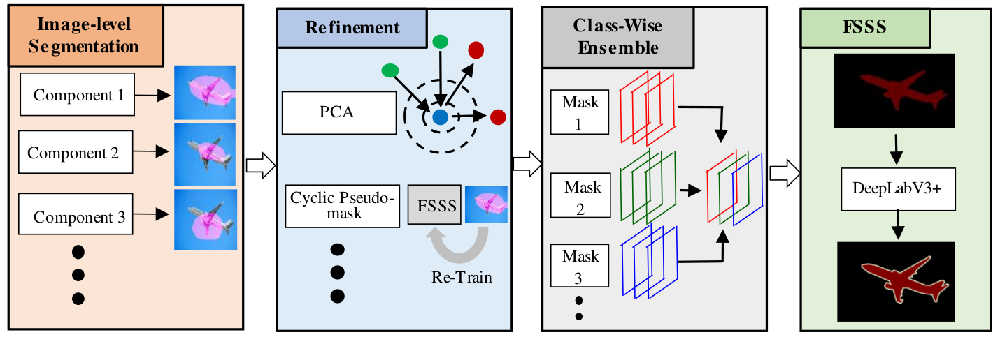
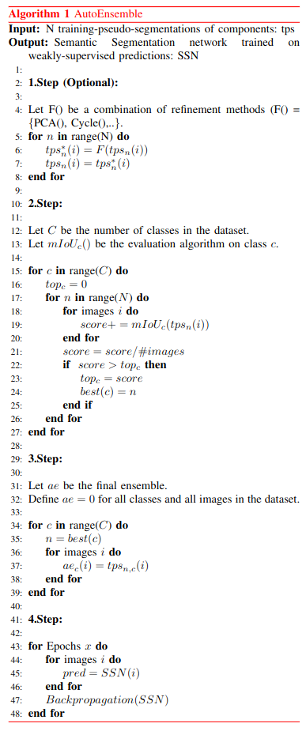

# AutoEnsemble: Automated Ensemble Search Framework for Semantic Segmentation Using Image Labels

## Abstract
A key bottleneck of employing state-of-the-art semantic segmentation networks in the real world is the availability of training labels. Standard semantic segmentation networks require massive pixel-wise annotated labels to reach state-of-the-art prediction quality. Hence, several works focus on semantic segmentation networks trained with only image-level annotations. However, when scrutinizing the state-of-the-art results in more detail, we notice that although they are very close to each other on average prediction quality, different approaches perform better in different classes while providing low quality in others. To address this problem, we propose a novel framework, AutoEnsemble, which employs an ensemble of the "pseudo-labels" for a given set of different segmentation techniques on a class-wise level. Pseudo-labels are the pixel-wise predictions of the image-level semantic segmentation frameworks used to train the final segmentation model. Our pseudo-labels seamlessly combine the strong points of multiple segmentation techniques approaches to reach superior prediction quality. We reach up to 2.4% improvement over AutoEnsemble's components. An exhaustive analysis was performed to demonstrate AutoEnsemble's effectiveness over state-of-the-art frameworks for image-level semantic segmentation.

## Overview

 

## Pseudo-Code

 

# Complexity Analysis

## Step. 1

Let $\{ Comp_1, Comp_2, ..., Comp_N \}$ be the list of Components. Each component takes as input as specific image $i$ from the list of all images $I$ and gives  as output class activation maps $CAM_n^{i,c}$ for all classes $c$ in the dataset.
$$Comp_n(i) =  \sum_{c=0}^C CAM_n^{i,c}, 1 \leq n \leq N$$
As the components are not further defined by the framework, we can only summarize their complexity as follows:
$$O(Step1) = \sum_{n=0}^N O(Comp_n^{training}(i)) \times O(Comp_n^{inference}(i)) \times epochs_{n} \times 2 \times I$$

## Step. 2

Let $\{ Ref_1, Ref_2, ..., Ref_M \}$ be the list of all applied refinements. We assume that all refinements are applied to all components for the ease of notation.
Then Step. 2 is defined as:
$$\widetilde{CAM_n^{i}} = Ref_1(CAM_n^{i}) \otimes Ref_2(CAM_n^{i}) \otimes ... \otimes Ref_M(CAM_n^{i})$$
For any $n$ with $1 \leq n \leq N$ Again, we need to define the complexity of each refinement method as $O(Ref_m())$ as the refinements are not further defined by the framework:
$$O(Step2) = \sum_{m=0}^M O(Ref_m^{training}(i)) \times O(Ref_m^{inference}(i)) \times epochs_{n} \times 2 \times I \times N$$

## Step. 3

The merging of pseudo-labels is done after a class-wise evaluation for each $\widetilde{CAM_n^{i}}$ to determine which Component after refinement has the high score for each class $c$ with 
$1 \leq c \leq C$ :
$$AE(i) = \sum_{c=1}^C AE^c(i) = \sum_{c=1}^C best(\widetilde{CAM_n^{c,i}})$$
For all $i$ in $I$
The refinement step and Class-Wise Ensemble are just linearly dependent on the number of Components: 
$$O(Step3) =  O(eval) + O(merger)  = I \times N \times C + I \times C $$

## Step. 4

The training of the DeepLabV3+ model is not different as in any other WSSS pipeline:
$$O(Step.4) = O(DeepLabV3+^{training} \times epochs \times images)$$

But for the final deployment of AutoEnsamble, only the forward pass of DeepLabV3+ is necessary, independent of the number of components ad refinements used: 

$$O(Deployment) = O(DeepLabV3+^{inference} \times images)$$

# Prerequisite
- Python 3.8, PyTorch 1.7.0, anaconda3
- CUDA 10.1, cuDNN 7.6.5

# Example images for comparison with the components

Pseudo-label examples from (a) DRS, (b) PMM, (c) PuzzleCAM, (d) CLIMS, (e) AutoEnsemble, (f) Ground truth.
In the this example, we notice that AutoEnsemble takes the best table and person mask from CLIMS and from PuzzleCAM the couch mask.

In the this example, we notice that AutoEnsemble takes the best table and person mask from CLIMS and from PuzzleCAM the couch mask.
In the second, we observe that AutoEnsemble has the most accurate person mask, while not using the mostly misclassified couch mask. The dog mask is slightly worse compared to CLIMS but the much better person mask outweights those misclassifications. 

